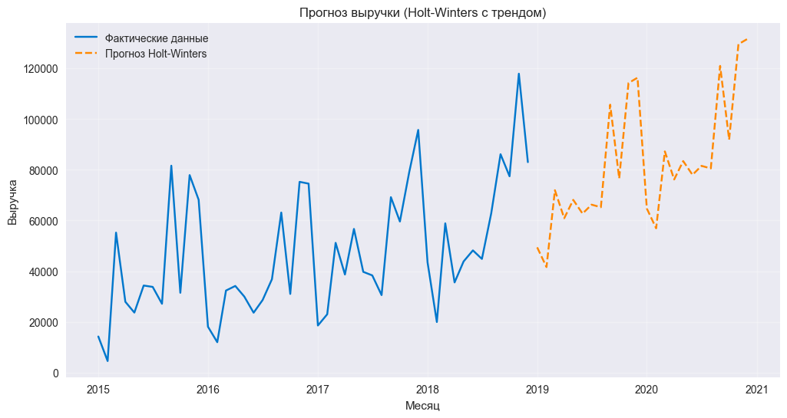

Анализ и прогноз выручки интернет-магазина (Superstore dataset)
Автор: Милютина Дарья Сергеевна
Учебный проект (РУДН, 3 курс)

Цель проекта

Исследовать сезонность и динамику продаж, построить прогноз выручки на основе временного ряда данных о заказах интернет-магазина

Датасет: Superstore dataset

Период: 2014–2019 гг.

Ключевые поля: Order Date, Sales, Category, Segment, Region

В текущей версии отсутствуют Profit, Discount, Quantity - поэтому акцент сделан на анализе выручки, без расчёта unit-экономики

Использованные модели

SARIMA (2, 2, 2)x(0, 1, 1, 12): выявлена выраженная сезонность

Holt-Winters: альтернативная модель сглаживания и прогноза

Сравнение моделей по метрикам AIC и MAE

Основные результаты

Сезонный пик продаж: ноябрь–декабрь, спад в январе

Построен прогноз выручки на 2019-2020 гг.

Проведена диагностика остатков (тест Ljung-Box, автокорреляция ACF)

Использованные инструменты
Python, pandas, matplotlib, statsmodels, seaborn, Power BI

Если вам понравился проект, поставьте звёздочку - это поможет развитию портфолио:)
