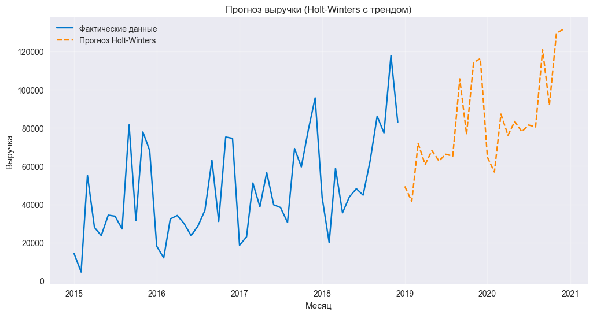

# Superstore Sales Forecast

Проект по анализу и прогнозированию выручки интернет-магазина на основе датасета Superstore.  

## О проекте

В проекте рассматривается месячная динамика выручки интернет-магазина. Данные были подготовлены, агрегированы по месяцам и использованы для анализа сезонности и построения прогноза.

## Цель проекта

Проанализировать динамику выручки интернет-магазина, выявить сезонные закономерности и сравнить модели прогнозирования временного ряда.

## Задачи

- загрузить и подготовить данные Superstore
- привести даты заказов к корректному формату
- агрегировать продажи по месяцам
- изучить динамику и сезонность выручки
- построить прогноз с помощью SARIMA
- построить альтернативный прогноз с помощью Holt-Winters
- сравнить модели по метрикам качества
- провести диагностику остатков
- сформулировать выводы 

## Используемые инструменты

- Python
- pandas
- numpy
- matplotlib
- seaborn
- statsmodels
- SARIMA
- Holt-Winters

## Основные результаты

- В месячной выручке заметна выраженная сезонность
- Пиковые значения продаж чаще приходятся на конец года, особенно на ноябрь–декабрь
- Построены прогнозы выручки с использованием SARIMA и Holt-Winters
- Holt-Winters использовался как альтернативная модель сглаживания с учётом тренда и сезонности
- Проведено сравнение моделей по качеству прогноза
- Выполнена диагностика остатков, чтобы проверить адекватность модели
